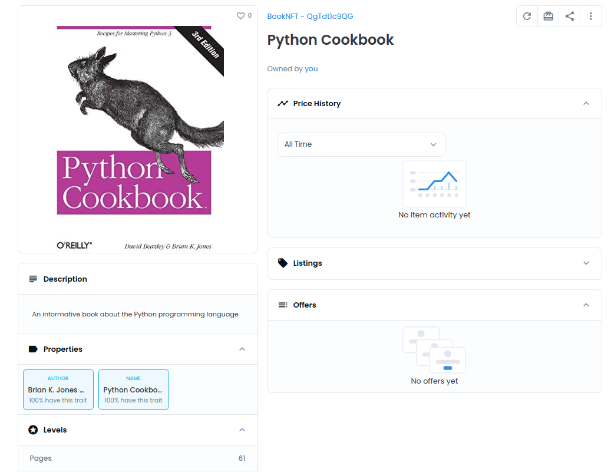
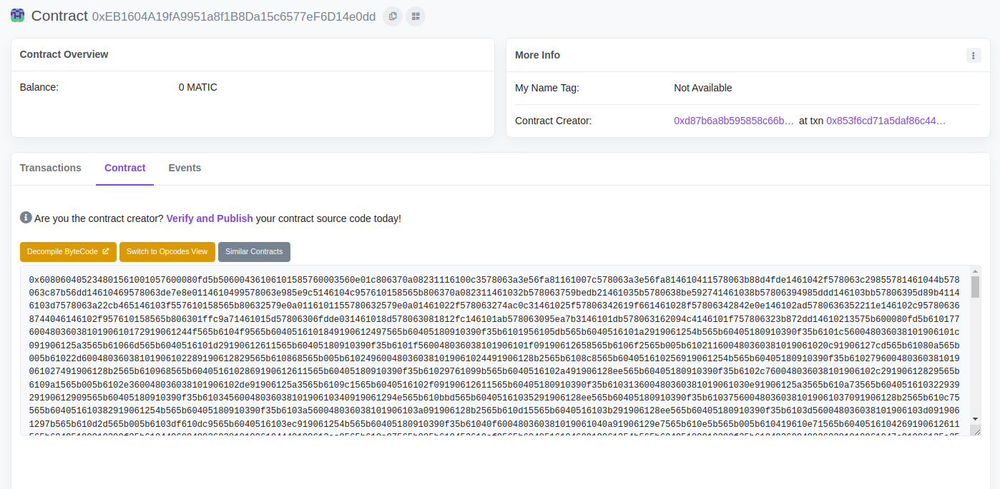
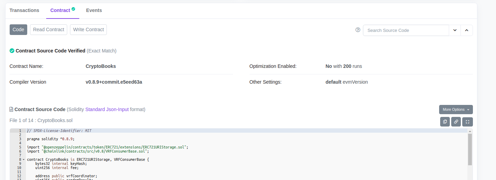
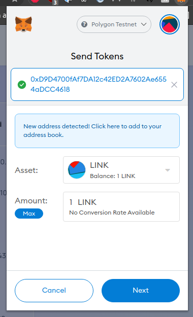
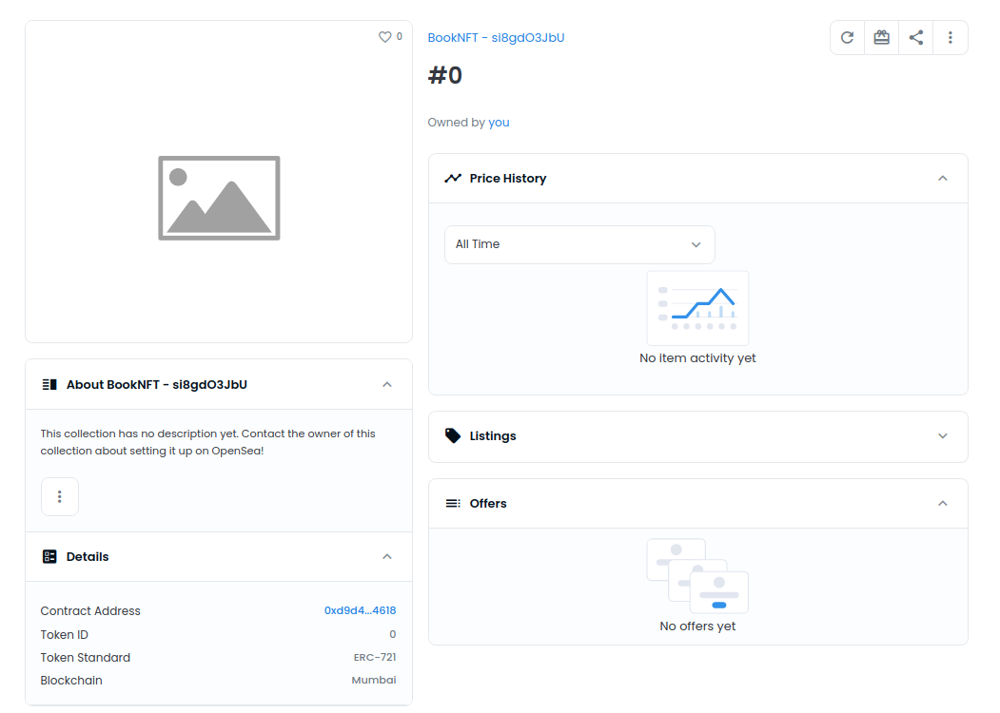

# Tutorial

This tutorial will take you through the steps required to create a simple NFT on the Polygon testnet, with Metadata hosted on IPFS.

By the end of this tutorial you will have created the following NFT, and it will be visible on OpenSea (on OpenSea's
testnet instance).

This tutorial is inspired by, and draws heavily on the knowledge shared in Patrick Collins'
[excellent talk done for the Chainlink Hackathon Workshop](https://youtu.be/EzZEx0lumr0).



## Getting started

If you intend on following this tutorial, you should checkout the: `simple-contract` branch.

Ensure you have followed the following sections described in the `README.md`:

- Configure MetaMask to connect to the Polygon Mumbai Testnet
- Obtain some testnet MATIC and LINK
- Obtain a PolygonScan API key

## Deploying our contract

First, we'll deploy our contract to the Polygon testnet. To do so, execute:

```
npx hardhat deploy --network polygon_testnet
```

Once the deployment completes, let's locate our contract on PolygonScan.

Navigate to [PolygonScan](https://mumbai.polygonscan.com/) and perform a search
on your wallet's public address. Under `Transactions` you'll see a transaction indicating
that the contract was deployed. Select `Contract Creation` to view the details of your contract.



At this stage all we can see is the bytecode of our contract, which isn't all that useful.

Before PolygonScan allows us to view source code, and interact with our contract from within its
UI, we will need to mark our contract as verified. See the `Verifying our contract` section in the
`README.md` for instructions on how to do this.

Once the contract is verified, we will be able to view our contract's source code, and interact with
it within PolygonScan.



## Funding our contract

The contract we've deployed makes use of the [Chainlink VRF](https://docs.chain.link/docs/chainlink-vrf/).

[Chainlink](https://docs.chain.link/docs/architecture-overview/) connects smart contracts with external data
using its decentralized oracle network.

In our contract, we use Chainlink to generate a random number. Often, NFTs will have an attribute such as `dna`
containing a random string. These strings are often used to seed random generators to determine the attributes
of the given NFT. In our contract, we simply request a random number and use it to randomly determine how many
pages our Book NFT will have.

When we make use of the Chainlink VRF, we are actually making a request to a Chainlink oracle for a random
number. Communicating with Chainlink oracles is not free, and requires LINK (Chainlink's token). At present,
our smart contract is configured to pay a fee of 0.1 LINK each time a request is made to the oracle for a
random number.

For this reason, we'll need to fund our contract with some LINK. To do so, open up MetaMask and send some of
your testnet link to your contract address.



Once the transaction confirms, your contract will be funded. You can view the balance of your contract on Polygonscan, or by querying the contract via the hardhat console.

## Minting our first NFT

Let's take a closer look at the Solidity code that we will be executing to mint our NFT:

```solidity
/**
 By declaring this function as public, and not specifying any access controls, we allow
 anyone to invoke it. To invoke the function, the caller will have to provide a name
 and author.
*/
function requestNewRandomBook(string memory name, string memory author)
  public
  returns (bytes32)
{
  // request a random number, using the `requestRandomness` function inherited by
  // subclassing `VRFConsumerBase`. `fulfillRandomness` is overridden from `VRFConsumerBase`,
  // this is the function that will be invoked once:
  // - `requestNewRandomBook` has returned
  // - The chainlink oracle has a random number ready for us
  bytes32 requestId = requestRandomness(keyHash, fee);
  // populate some mappings, these mappings will be used later on in the `fulfillRandomness`
  // function to identify the original callers wallet address and supplied NFT attributes.
  requestToBookName[requestId] = name;
  requestToAuthorName[requestId] = author;
  requestToSender[requestId] = msg.sender;
  return requestId;
}

// By declaring this function as `internal`, we prevent any invocations from outside
// the contract, ensuring this function may only be called within our contract
function fulfillRandomness(bytes32 requestId, uint256 randomNumber)
  internal
  override
{
  // The `books` array contains all minted nfts, use the length of this array to create
  // a unique identifier for the NFT we are about to mint
  uint256 newId = books.length;
  // determine the number of pages using the random number provided by Chainlink
  uint256 pages = (randomNumber % 100);

  // keep track of the NFT we are about to mint, by storing it in the `books` array.
  books.push(
    Book(requestToAuthorName[requestId], requestToBookName[requestId], pages)
  );
  // use the `safeMint` function to mint our NFT, and distribute it to the owner
  _safeMint(requestToSender[requestId], newId);
}

```

So as we can see, we'll need to invoke the `requestNewRandomBook` function exposed in our smart contract
in order to mint an NFT. Since this function will write some data to the blockchain, it will cost us some MATIC
tokens to invoke.

We can mint tokens using the hardhat console, or by using MetaMask + Polygonscan. For this tutorial, we'll use
Polygonscan.

Navigate to your contract on Polygonscan, and go to `Write Contract`, here you will see all the available
functions within the smart contract that modify the state of the blockchain. All of these functions will cost
MATIC to invoke. Conversely, under `Read Contract` are all the read only functions. These functions cost no
MATIC to invoke, and can be called for free, since they don't modify the state of the blockchain.

Find the `requestNewRandomBook` function on Polygonscan and input a name and author, and select `Write`.

That's it! You've just minted your first NFT!

## Confirming the details of our minted NFT

If we want to see the details of the NFT we just minted, we can use some of the function listed in the
`Read Contract` section of polygonscan.

In our smart contract, we declare the `books` attribute as public. When this contract is compiled, solidity will
automatically generate a getter function for this attribute, which can be used to access the contents of the
array. For instance, if we wish to see the attributes of the book we just minted, we can supply the book id (in
our case it should be `0`) annd click `Query`.

If we wish to see how many NFTs are owned by a given address, we can execute the `balanceOf` function.

If we wish to see the wallet address of the owner of a given token, we may execute the `ownerOf` function.

At this stage, we should also be able to find our NFT on the OpenSea testnet.

Navigate to the [OpenSea testnet](https://testnets.opensea.io/), click on your profile and go to the `Hidden`
section (not too sure why they pop up here, still learning). You should find your freshly minted NFT there.



But hmmm, something is not quite right. Where is all the metadata?? We'll be covering this in the next section.

## Setting up the Metadata for our NFT

To properly understand NFT metadata, we first need to grasp the concept of on-chain and off-chain metadata.

- On-chain metadata is metadata stored directly on the blockchain, examples of on-chain metadata for our
  freshly minted NFT is:
  - Its name
  - Its number of pages
  - Its author
- Off-chain metadata is metadata stored external to the blockchain. This could be on a centralized server, or on
  a decentralized network such as IPFS. Generally IPFS is preferred, due to its decentralized nature, and no
  single point of failure.

So you might be asking, why isn't our on chain metadata being displayed on OpenSea?? Well, at the moment,
OpenSea does not have a way of reading on-chain attributes of NFTs. Instead, OpenSea relies on accessing a
`tokenURI` attribute specific to each NFT, it is expect that this URI will point to an endpoint that returns
JSON that conforms to the metadata standard discussed in
[EIP-721](https://github.com/ethereum/EIPs/blob/master/EIPS/eip-721.md).

Regarding the metadata standard discussed in EIP721, this is not _exactly_ the standard we will want to adhere
to... Over time, NFTs have gained popularity, and extensions to the metadata
schema [have been proposed](https://github.com/ethereum/EIPs/pull/1028), so more metadata can be attributed to
the NFT. It's not clear whether these proposals have been accepted or not. However, OpenSea mention:

> OpenSea supports metadata that is structured according to the official ERC721 metadata standard or the Enjin Metadata suggestions.
> Additionally, we support several other properties that allow for multimedia attachments -- including audio, video, and 3D models -- plus interactive traits for your items, giving you all the sorting and filtering capabilities on the OpenSea marketplace.

You can read more about the expected metadata structure for NFTs on
[OpenSea's site here](https://docs.opensea.io/docs/metadata-standards).

Now, as you might imagine, what if this metadata is changed? What if it is hosted on a centralised source and this source goes down? Which metadata should be stored on-chain, and which metadata should be stored off-chain?

Well, if you really wish to consider some attribute a "characteristic" of your NFT, the answer is, it should be
stored on chain **and** off-chain within the metadata returned by your `tokenURI` endpoint. Of course, this is not
going to be possible with all metadata, for instance, storing an image on chain can be very expensive, and a
video being stored on chain is just way too expensive, and in that case, your only choice is to store this
data off-chain in your token metadata.

### Setting up our tokenURI

Now we'll set up our off-chain metadata for our NFT. For this tutorial we'll be hosting the data in IPFS, although
you may choose to host the data on a centralized server.

One major drawback of IPFS is that, if not enough nodes hold the data you are storing, the data can dissappear
(think a torrent with no seeders). One way around this is to `pin` the metadata in IPFS. Pinning is the mechanism
that allows you to tell IPFS to always keep a given object somewhere (on 1 or more nodes), ensuring it is
not lost. Services like Pinata help ensure your IPFS files are never 'forgotten' by the network, and remain
pinned always.

For now, we'll run our own local IPFS node, and host our metadata there.

[Download and install IPFS](https://docs.ipfs.io/install/ipfs-desktop/), the desktop version makes setup very
straightforward, but you are free to use the CLI if you wish.

Once IPFS is installed and your node is running, you can continue.

We'll be storing some very simple metadata in IPFS:

```json
{
  "name": "Name of your NFT goes here",
  "description": "Description of your NFT goes here",
  "image": "Image URL of your NFT goes here",
  "attributes": [
    { "trait_type": "Author", "value": "Author name here" },
    { "trait_type": "Pages", "value": 0 }
  ]
}
```

Create a JSON file structured like the one above, and begin replacing the name, description,
attributes etc. with values that reflect what is stored on chain. If you've forgotten what
you assigned as attributes as your NFT, don't forget you can query the smart contract using the `books` function
and supplying the id of your token (the id will be 0, if this is the first token you minted using the contract).

The `image` key should have a value that corresponds to a URL pointing to the NFTs image, this can be an IPFS url or
a URL that points to a centralized data source.

Remember, the attributes in your JSON file should match the on-chain metadata exactly (aside from the image which doesn't exist
on-chain) so it provides an accurate representation of the actual NFT.

Now we need to modify our NFT and set its `tokenURI`, we can do that using the `setTokenURI` method defined in our contract, let's
take a closer look at it:

```solidity
// This function is public, meaning absolutely anyone can invoke it.
function setTokenURI(uint256 tokenId, string memory _tokenURI) public {
  // Some very basic access control, which only allows the function to proceed if the caller is
  // the token owner or if the caller is on the approved list.
  require(_isApprovedOrOwner(_msgSender(), tokenId), "Not approved or owner");
  // sets a new tokenURI
  _setTokenURI(tokenId, _tokenURI);
}

```

This simple function allows us to set the `tokenURI`, it restricts access so only the token owner, or accounts on the tokens
approve list can actually set a new URI.

So, once your metadata is uploaded to IPFS, navigate to PolygonScan, and execute the `setTokenURI` function, providing a URI pointing
to your file stored in IPFS.

Once this is done, go back to the NFT on OpenSea and select the `Refresh metadata` button. Wait a few minutes and check back in,
OpenSea should now be displaying the metadata for your NFT as described in the file stored in IPFS!

Nice work! You just minted your first NFT, complete with metadata stored on a decentralized network!!!
