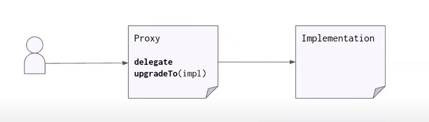
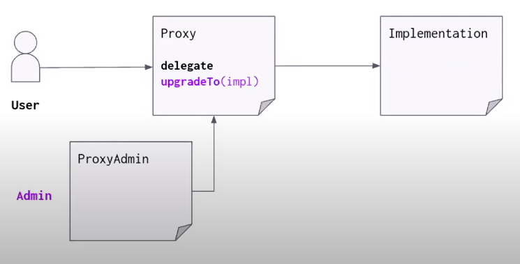
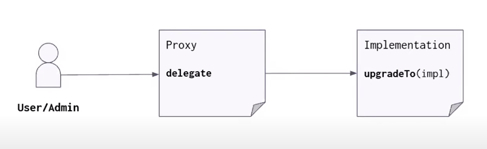
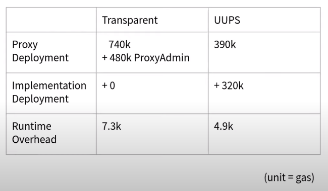

# Smart contract proxies

So, a great feature of smart contract is the fact that they're immutable. If we tweak our contract, and perform a re-deployment,
the original smart contract is not updated, instead, an entirely new one is created. The immutability of smart contracts offers some
advantages, such as:

- When we interact with a smart contract, we'll always know exactly what code is being executed.
- There is no central authority on what the contract should and shouldn't do, once it is deployed to the blockchain, it can never be modified
  and users can have confidence that the functionality of the contract will never change (a single bad actor can't update the contract to contain
  malicious code).

However, the idea of a smart contract being immutable is a little scary.

- What if a bug is found in your smart contract?
- What if you want to introduce new functionality?

Well, with a traditional smart contract this is still possible, but is tedious and difficult, for instance, you'd have to:

1. Deploy a new version of the contract

2. Manually migrate all state from the old one contract to the new one (which can be very expensive in terms of gas fees!)

3. Update all contracts that interacted with the old contract to use the address of the new one

4. Reach out to all your users and convince them to start using the new deployment (and handle both contracts being used simultaneously, as users are slow to migrate)

These are significant challenges.. But... What if I told you there **was** a way to address these challenges?

## Introducing the idea of smart contract proxies

This overview draws heavily on the information presented by Francisco Giordano in his [OpenZeppelin workshop](https://youtu.be/kWUDTZhxKZI)
that was published to youtube.

Put simply, smart contract proxies allow us to change the contract code, while preserving the state, balance, and address.

At the time of writing, there are four popular standards that exist for implementing smart contract proxies:

- Transparent Upgradeable Proxy (currently used in this project)
- UUPS (Universal Upgradeable Proxy Standard) Proxy
- Diamond Proxy (not discussed in this overview)
- Beacon Proxy (not discussed in this overview)

Before we go into the details of each standard, let's gain a high level understanding of how smart contract proxies work.

Making use of a smart contract proxy involves deploying two smart contracts:

- The proxy contract
- The implementation contract

Users will interact with the proxy contract, and not with the implementation contract.

The proxy contract stores the address of the implementation contract, when the proxy contract is interacted with, it will call functions in the implementation contract.

When we wish to upgrade our implementation, we modify our proxy contract, so it points to the new implementation address.

That's it! Well.. sort of, let's do a deeper dive on **why** this works, and why we don't lose state etc.

## Deeper dive on proxies

Every smart contract possesses the following components:

- It's code
- It's memory (while it executes)
- It's storage (persistent, the smart contract's "state")

As mentioned earlier, when we make use of a proxy, its storage will contain the address of the implementation contract, and we are able
to "upgrade" the contract our users interact with by simply deploying a new implementation contract, and pointing our proxy to this new implementation contract.

Let's think about a typical interaction between two smart contracts.

**Smart Contract A**

- Contains the following properties:
  - (string) value
- Contains the following function:
  - setValue(string valueToSet)
- When we call `setValue`, it modifies the storage of the smart contract, and sets `value` to `valueToSet`.

**Smart Contract B**

- Contains the following function:
  - callSetValue(string valueToPass)
- When we call `callSetValue`, this function will execute a [message call](https://docs.soliditylang.org/en/latest/introduction-to-smart-contracts.html#message-calls)
  in order to invoke `setValue` on `Smart Contract A`.

When we execute `callSetValue` on `Smart Contract B`, `Smart Contract B` will execute a
message call on `Smart Contract A` resulting in `setValue` being invoked. When `setValue` runs it will modify the storage of
`Smart Contract A`. As programmers, this is intuitive, its similar to how two classes might interact with each other.

Now think about the above example in the context of a proxy. There is a logical gap/flaw, before reading on, try to work out what this
might be, here are a couple of hints:

- Remember, the whole idea of a smart contract proxy is that we can simply point the proxy to a brand new implementation contract.
- In our example above with contracts A & B, when B is invoked it makes a message call to contract A, and contract A's storage is modified.

So, hopefully you're now asking yourself:

- Haven't we lost the state contained in our implementation contract once we point the proxy to a new implementation?
- If we point our proxy to a new implementation contract, how is state retained (since state is stored in our implementation contract right)?

To understand how proxies maintain state, we need to look into a Solidity function called `delegateCall`, a special variant of a message call. `delegateCall` is **identical** to a message call, apart from the fact that **the code at the target address is executed in the context
of the calling calling contract, and `msg.sender`/`msg.value` do not change their values**.

Smart contract proxies _do not_ make use of message calls _and instead_ make use of `delegateCall`.

It's important to grasp the difference between a regular message call and `delegateCall`, and why a proxy would want to use `delegateCall`.
The use of `delegateCall` ensures that, when we point our proxy to a new implementation contract, state is maintained.

EIP-1967 was a standard that was proposed and accepted, its goal was to standardise the storage locations within the proxy
contract where proxy/implementation data is stored. Both UUPS and transparent upgradeable proxies can and should make use of this standard.
Feel free to [read the EIP](https://eips.ethereum.org/EIPS/eip-1967) if you want to do a deeper dive, although I'd reccommend
finishing this overview first.

Now we're ready to move on to some specifics about transparent upgradeable proxies and UUPS proxies.

## Transparent upgradeable proxies

Implementing the most basic transparent proxy involves:

- Writing a proxy smart contract
- Writing an implementation smart contract.

At the core of the proxy smart contract will be two functions:

- `delegate` - This is used to delegate a call to the implementation contract
- `upgradeTo` - This is used to update the address of the implementation contract held in the proxy's storage.

(Taken from [OpenZeppelin's workshop](https://youtu.be/kWUDTZhxKZI) on deploying more efficient upgradeable contracts, presented by
Francisco Giordano)

A transparent proxy has two separate "interfaces" it can reveal when a user calls it. There is an interface for the administrator, and
there is an interface for a regular user.

- The administrator interface
  - Exposes 'admin' functionality, such as `upgradeTo`, the admin is **prevented** from accessing the `delegate` function.
- The regular user interface
  - Exposes 'regular user' functionality, such as `delegateCall`, the user is **prevented** from accessing the `upgradeTo` function and
    any other admin functions.

Having this separation prevents any possibility of an admin accidentally calling an implementation function, and prevents the user from
calling any proxy admin functionality. It also
[mitigates a security risk](https://medium.com/nomic-labs-blog/malicious-backdoors-in-ethereum-proxies-62629adf3357) that is posed when
a clash exists between an admin function in the proxy contract and a function in the implementation contract.

A recommended pattern is to incorporate a third contract, usually referred to as the `ProxyAdmin` contract. This contract will be set up
as the 'admin' of the proxy. This contract acts as the real administrative interface of the proxy. Only calls via this contract will have access to admin functionality within the proxy. All other calls made directly to the contract are treated as regular user calls.
Such an abstraction helps keep the separation between admin/user interface clear and reduces complexity.

(Taken from [OpenZeppelin's workshop](https://youtu.be/kWUDTZhxKZI) on deploying more efficient upgradeable contracts, presented by
Francisco Giordano)

So, I bet you're thinking "transparent proxies sound awesome!", and they are! But there is a downside that should be considered.

### The downside of using transparent proxies

One of the **most expensive** operations a smart contract can perform is read/write from storage (read operations are free only if called
statically and locally, they are not free if they are part of a transaction).

When we interact with a transparent proxy proxy,the proxy needs to perform two storage access operations:

- Retrieve the admin address of the proxy (to determine whether to expose the `admin` interface, or the `user` interface)
- Retrieve the implementation address

In the early days of the transparent proxy, accessing storage was not that expensive. However...

- When the `Istanbul` upgrade was released, the cost of accessing storage quadrupled.
- When the `Berlin` upgrade was released, the cost of accessing storage more than doubled.

The UUPS proxy was created in order to address this downside, so let's learn about it!

## UUPS (Universal Upgradeable Proxy Standard)

As mentioned earlier, the UUPS was developed in order to mitigate/eliminate the gas fees associated with retrieving the admin address of
the proxy each time a call is made.

UUPS proxies operate on a very similar mechanism to what is seen in a transparent upgradeable proxy. However there is one important change: the `upgradeTo` functionality is moved to the implementation contract, rather than living in the proxy contract.

At first, this might seem a little counter-intuitive. How does the implementation contract modify our proxy contract?

Think back to the section on `delegateCall`, remember, anything invoked using `delegateCall` in our implementation contract will be executed
within the scope of the proxy. So, when we execute `upgradeTo` using `delegateCall`, `upgradeTo` is able to modify the storage of our
proxy contract (and in the case of a UUPS proxy, update the proxy's implementation address to the new implementation address).

With the UUPS pattern, we only need to retrieve the proxy admin address from storage if an attempt to hit the `upgradeTo` function is made.
Contrast this to the universal upgradeable proxy pattern where every single call must retrieve the proxy admin address from storage. An
additional benefit is that we are able to modify our `upgradeTo` function, since it no longer lives in the proxy contract and instead lives
in the implementation contract.

However, there are downsides to using the UUPS.

### The downside of using UUPS

One of the biggest drawbacks of the UUPS is the fact that we are adding complexity to our implementation contract. Remember, the
implementation contract is the one we will be updating all the time. What if we forget to include the `upgradeTo` function in a later version
of our implementation contract, or what if we introduce a bug somehow that prevents `upgradeTo` from executing properly. Well, in this case,
you're completely out of luck and your contract is no longer upgradeable.

Much more care needs to be taken when working with UUPS contracts, lest you risk bricking your upgrade functionality.

## Summary comparison of UUPS & Transparent Upgradeable proxies

**Transparent Upgradeable Proxies**

Benefits of transparent upgradeable proxies:

- There is no easy way to brick our upgrade mechanism.
- We incur less of a fee when deploying our implementation (since the `upgradeTo` function is omitted)
- There is a clear separation of proxy admin functionality (via the ProxyAdmin contract), it's hard to initiate an upgrade accidentally.

Drawbacks of transparent upgradeable proxies:

- We incur a higher runtime overhead, since the admin address has to be retrieved from storage upon each call.
- Although a once off, the ProxyAdmin contract will have to be deployed, which incurs a fee.
- The deployment of the proxy itself is a little expensive (relative to a UUPS proxy), since it must include additional code to retrieve
  the owner, determine whether to `delegateCall` or not etc.

---

**UUPS Proxies**

Benefits of UUPS proxies:

- We can update the logic of our `upgradeTo` function.
- We incur a lower runtime overhead, since each call no longer needs to retrieve the proxy admin address from storage.
- Deployment of the proxy is not that expensive (relative to a transparent upgradeable proxy), since the proxy contract is a little "leaner".
- There is no need to deploy an AdminContract.

Drawbacks of UUPS proxies:

- It is possible to "brick" our upgrade mechanism.
- Since interacting with the proxy admin functionalities are not constrained to only be performed via an admin contract, it is a bit easier
  to make a mistake and accidentally call some admin functionality when intending to call regular user functionality.
- Implementation deployments will become more expensive, since we have to ship the `upgradeTo` functionality with our implementation contract.

---

**Cost Comparison**

(Taken from [OpenZeppelin's workshop](https://youtu.be/kWUDTZhxKZI) on deploying more efficient upgradeable contracts, presented by
Francisco Giordano. These stats were published on June 21st 2021.)

## Conclusion

I hope you've learned something about smart contract proxies! After performing the research for this overview, I am under the impression
that, if you are considering implementing a smart contract proxy, to go for the UUPS approach. This is because it reduces the costs associated
with invoking your smart contract, which is important to users, and also allows for an 'upgradeable' update mechanism, which could be useful.

It's also unclear how much further gas prices will increase when it comes to accessing a contract's storage, which reinforces my belief
that a UUPS proxy is the way to go.

I have not researched diamond proxies or beacon proxies, but it's something I intend on looking into, and will hopefully write up an overview
of them, much like this overview.

Thanks for reading!

## Resources

- [Breakdown explaining Transparent vs UUPS proxies](https://youtu.be/kWUDTZhxKZI)
- [Ethereum Blockchain Developer Guide on Proxies](https://ethereum-blockchain-developer.com/110-upgrade-smart-contracts/00-project/)
